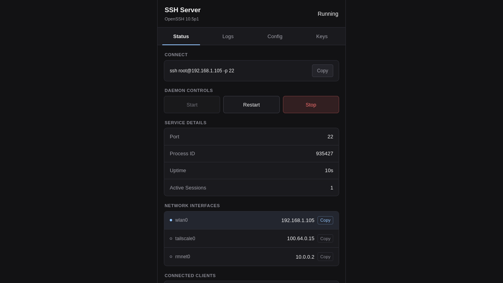
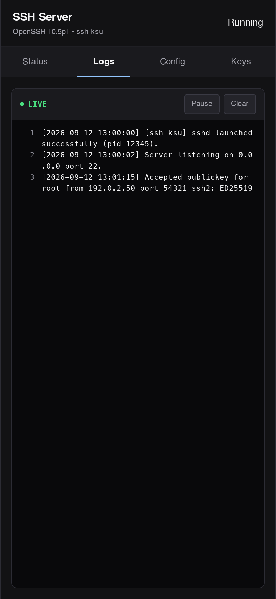
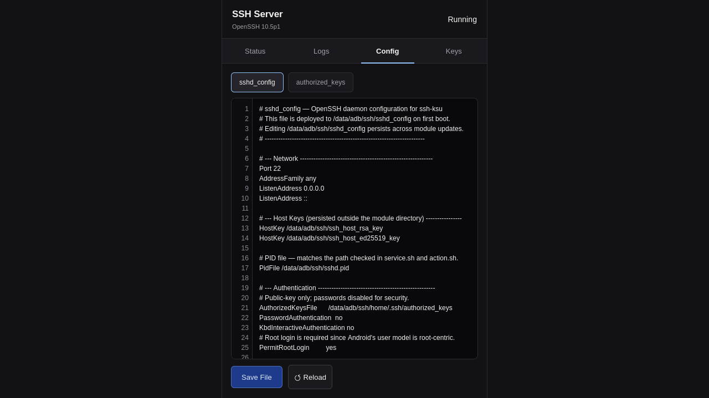
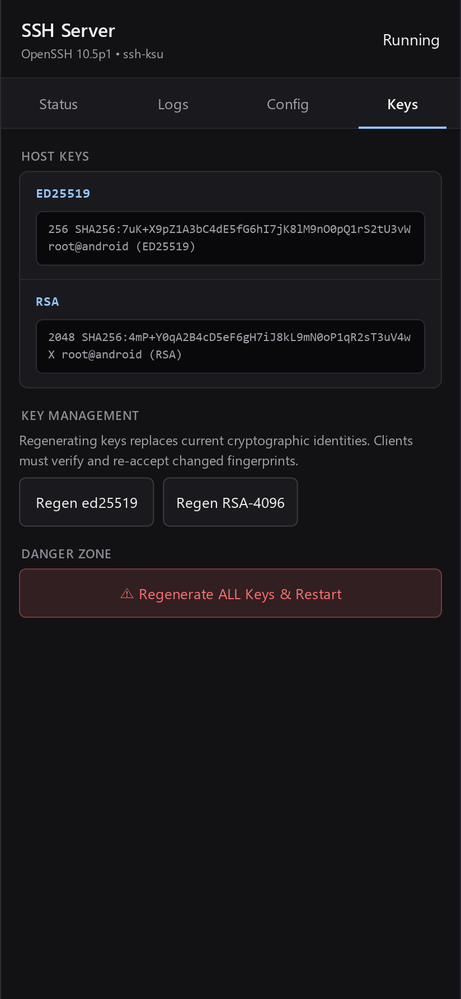

# ssh-ksu: Statically Compiled OpenSSH & Bash for KernelSU & Magisk

[](https://github.com/jtnqr/ssh-ksu/releases/latest)
[](LICENSE)

A hardened OpenSSH and Bash server module designed specifically for Android devices rooted via KernelSU or Magisk. The project compiles standard Linux networking and terminal utilities statically to run seamlessly within Android's constrained user space with zero shared-library bloat and a lightweight, utilitarian WebUI.

---

## WebUI Overview

`ssh-ksu` features an integrated, WCAG 2.1 & 2.2 Level AA compliant web interface accessible directly inside KernelSU / Magisk Manager.

| **Dashboard & Quick Connect** | **Real-Time Live Logs** |
| :---: | :---: |
|  |  |
| *1-Tap connect command sync, tactile service controls, and network interfaces* | *Real-time log viewer with dedicated line number gutter and pause/clear* |

| **Configuration Editor** | **Host Key Management** |
| :---: | :---: |
|  |  |
| *1:1 synchronized line gutters and safe Base64 streaming writes* | *Monospace fingerprint boxes with 1-tap copy, key rotation, and Danger Zone* |

---

## System Operation & Architecture

Stock Android systems lack traditional POSIX structures like `/etc/passwd` and `/etc/resolv.conf`. Directly executing standard Linux binaries on Android typically fails due to missing dynamic library dependencies in Bionic and strict SELinux rules.

To resolve this, `ssh-ksu` operates via:
1. **Static Compilation via musl libc**: All binaries (OpenSSH, Bash, GNU Nano, htop, and tmux) are statically compiled against `musl libc`, removing all runtime dependencies on Android system libraries.
2. **Mount Namespace Isolation (`unshare -m`)**: The SSH daemon executes inside an isolated mount namespace, allowing the module to mount a private writeable OverlayFS (or fallback to tmpfs) over `/system/etc`.
3. **Pre-Mount Virtual Configuration Injection**: Dynamic configuration files (`passwd` and `resolv.conf`) are written to the writable OverlayFS upper directory before mounting. This avoids path-based SELinux/VFS write blocks, ensuring immediate presence and writeability inside `/etc/`.

---

## Core Integrated Utilities

* **OpenSSH (v10.5p1)**: Initiates the `sshd` daemon inside the isolated mount namespace, enforcing public-key-only authentication by default. Cryptographically secure Ed25519 system host keys are generated automatically upon installation.
* **OpenSSL (v4.0.2)**: Modern static cryptography backend powering OpenSSH with hardened cipher suites.
* **rsync (v3.5.0)**: Statically linked with musl to allow robust remote file synchronization without requiring local ADB sessions.
* **GNU Bash (v5.3)**: Standardized POSIX shell replacing Android's minimal `/system/bin/sh`, providing predictable command execution and full readline support.
* **tmux (v3.7c)**: Statically linked with `libevent` (v2.1.13-stable) for persistent terminal multiplexing surviving network disconnects.
* **htop (v3.5.3)**: Statically compiled system resource monitor and thread viewer.
* **GNU Nano (v9.2)**: Lightweight console editor with built-in syntax highlighting for on-device config edits.

---

## Security & Reliability Hardening

* **Safe Base64 Streaming Writes**: WebUI file modifications (`sshd_config`, `authorized_keys`) stream payloads through Base64 decoding (`printf '%s' '$b64' | base64 -d > ...`), preventing command injection and `ARG_MAX` buffer truncation.
* **PID Cmdline Verification**: Process monitoring checks `/proc/$PID/cmdline` for `sshd` rather than directory existence alone, eliminating false-positive liveness from recycled PIDs.
* **SELinux PTY Allocation**: Grants `su` domain `devpts chr_file` permissions (`open read write getattr ioctl`) to fix interactive terminal allocation panics on strict OEM ROMs.
* **Interactive PATH Integration**: Automatically prepends `/data/adb/modules/ssh-ksu/system/bin` to `PATH` in `etc/profile` and user profile hooks.
* **Network Client Fallback**: Features dual `ss` and `netstat -tn` discovery mechanisms for active client tracking on stock Android kernels.

---

## Directory Layout

* **`.github/workflows/build.yml`**: CI/CD release workflow with compiler caching.
* **`build/Dockerfile`**: Hardened, unprivileged (`builder` UID 1000) compilation environment.
* **`build/build.sh`**: Source fetching, patch application, and static musl compiler pipeline.
* **`build/verify.sh`**: Post-build static linkage and ELF architecture validator.
* **`tests/run_tests.sh`**: Automated QA suite validating scripts, paths, and namespace mounting.
* **`tests/e2e/server.py`**: Automated headless browser E2E test harness.
* **`webroot/`**: Utilitarian WebUI rendered inside KernelSU and Magisk Manager.
* **`action.sh`**: Interactive start, stop, and status polling script.
* **`service.sh` / `boot-completed.sh`**: Early boot launcher and late-boot watchdog workers.
* **`customize.sh` / `uninstall.sh`**: Module installer and uninstaller lifecycle hooks.
* **`pack.sh`**: Distribution bundler producing universal flashable ZIPs.

---

## Deployment Guide

### 1. Obtain or Build the Release Package
Download the latest pre-compiled universal archive directly from [GitHub Releases](https://github.com/jtnqr/ssh-ksu/releases/latest).

Alternatively, build the module locally from source:
```bash
bash pack.sh --arch all
```
This produces `release/ssh-ksu-<version>.zip` along with its SHA-256 checksum.

### 2. Flash the Module
1. Copy the ZIP archive to your Android device.
2. Open **KernelSU Manager** or **Magisk Manager**.
3. Select **Modules** &rarr; **Install from storage**.
4. Select the downloaded ZIP (`ssh-ksu-*.zip`), wait for installation to complete, and reboot.

### 3. Authorize SSH Public Key
Password authentication is disabled for security. Inject your public key into the user home directory:
```bash
# Push public key to authorized_keys
adb push ~/.ssh/id_ed25519.pub /data/adb/ssh/home/.ssh/authorized_keys

# Set secure permissions
adb shell chmod 700 /data/adb/ssh/home/.ssh
adb shell chmod 600 /data/adb/ssh/home/.ssh/authorized_keys
adb shell chown -R root:root /data/adb/ssh/home
```

### 4. Connect Over SSH
Execute the connection command from your host terminal:
```bash
ssh root@<device-ip-address> -p 22
```

---

## License

Distributed under the terms of the GNU General Public License v3.0 (GPL-3.0). See `LICENSE` for details.
